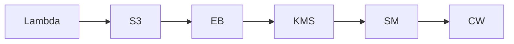

# InfraTales | AWS CDK S3 to Lambda via EventBridge: Full Cost and Architecture Breakdown

**AWS CDK (TYPESCRIPT) reference architecture — serverless pillar | advanced level**

> You need Lambda functions to react to S3 events reliably in production, but wiring up S3 notifications, EventBridge routing, CloudTrail data events, VPC placement, KMS encryption, and CloudWatch log retention into a single deployable unit without cutting corners is genuinely tedious. Most teams end up with either a half-baked setup missing audit trails or a gold-plated one with runaway KMS API call costs they didn't anticipate. This stack tries to close that gap by codifying the full security and observability surface of an S3-triggered serverless workflow in CDK TypeScript.

[](LICENSE)
[](CONTRIBUTING.md)
[](https://aws.amazon.com/)
[-IaC-purple.svg)](https://aws.amazon.com/cdk/)
[](https://infratales.com/p/988a7ef5-0fa3-4025-be0a-30faafbcb86a/)
[](https://infratales.com)


## 📋 Table of Contents

- [Overview](#-overview)
- [Architecture](#-architecture)
- [Key Design Decisions](#-key-design-decisions)
- [Getting Started](#-getting-started)
- [Deployment](#-deployment)
- [Docs](#-docs)
- [Full Guide](#-full-guide-on-infratales)
- [License](#-license)

---

## 🎯 Overview

The stack wires an S3 bucket as the event source and routes object-level activity through CloudTrail data events into EventBridge, then triggers a VPC-placed Lambda function — meaning the function has private network access without relying on the legacy S3-to-Lambda direct notification path [from-code]. KMS encrypts the bucket and Lambda environment, Secrets Manager and SSM Parameter Store handle runtime credentials, and a CloudWatch LogGroup with explicit retention is attached to the Lambda so logs don't accumulate indefinitely [from-code]. The non-obvious design choice is using CloudTrail plus EventBridge as the event pipeline instead of a direct S3 event notification, which trades lower latency for richer filtering, a full audit record of every object operation, and the ability to fan out to multiple targets without touching the bucket configuration [editorial]. VPC endpoint provisioning for S3, Secrets Manager, and SSM is required for the Lambda to reach AWS services privately, and each endpoint carries an ~$7/month/AZ cost that teams consistently undercount when sizing this architecture [inferred].

**Pillar:** SERVERLESS — part of the [InfraTales AWS Reference Architecture series](https://infratales.com).
**Target audience:** advanced cloud and DevOps engineers building production AWS infrastructure.

---

## 🏗️ Architecture



> 📐 See [`diagrams/`](diagrams/) for full architecture, sequence, and data flow diagrams.

> Architecture diagrams in [`diagrams/`](diagrams/) show the full service topology (architecture, sequence, and data flow).
> The [`docs/architecture.md`](docs/architecture.md) file covers component responsibilities and data flow.

---

## 🔑 Key Design Decisions

- CloudTrail data events for S3 cost $0.10 per 100k events — a bucket receiving millions of PUTs per day can generate a CloudTrail bill that dwarfs the Lambda execution cost itself [inferred]
- Routing through EventBridge adds ~1-3 seconds of end-to-end latency compared to a direct S3-to-Lambda notification trigger — acceptable for audit pipelines, fatal for real-time processing requirements [inferred]
- Placing the Lambda inside a VPC adds cold start overhead (ENI attachment) and requires NAT Gateway or VPC endpoints for the Lambda to reach S3, Secrets Manager, and SSM — each VPC endpoint costs ~$7/month/AZ [inferred]
- KMS CMK usage across S3, Lambda, and CloudWatch Logs means every encryption/decryption operation is a KMS API call at $0.03 per 10k requests — high-throughput workloads need key caching or per-service key strategies to keep this bounded [inferred]
- LocalStack detection baked into the stack via environment variable checks is a pragmatic dev experience decision, but it introduces a conditional code path that is never exercised in CI unless LocalStack is explicitly wired into the pipeline [from-code]

> For the full reasoning behind each decision — cost models, alternatives considered, and what breaks at scale — see the **[Full Guide on InfraTales](https://infratales.com/p/988a7ef5-0fa3-4025-be0a-30faafbcb86a/)**.

---

## 🚀 Getting Started

### Prerequisites

```bash
node >= 18
npm >= 9
aws-cdk >= 2.x
AWS CLI configured with appropriate permissions
```

### Install

```bash
git clone https://github.com/InfraTales/<repo-name>.git
cd <repo-name>
npm install
```

### Bootstrap (first time per account/region)

```bash
cdk bootstrap aws://YOUR_ACCOUNT_ID/YOUR_REGION
```

---

## 📦 Deployment

```bash
# Review what will be created
cdk diff --context env=dev

# Deploy to dev
cdk deploy --context env=dev

# Deploy to production (requires broadening approval)
cdk deploy --context env=prod --require-approval broadening
```

> ⚠️ Always run `cdk diff` before deploying to production. Review all IAM and security group changes.

---

## 📂 Docs

| Document | Description |
|---|---|
| [Architecture](docs/architecture.md) | System design, component responsibilities, data flow |
| [Runbook](docs/runbook.md) | Operational runbook for on-call engineers |
| [Cost Model](docs/cost.md) | Cost breakdown by component and environment (₹) |
| [Security](docs/security.md) | Security controls, IAM boundaries, compliance notes |
| [Troubleshooting](docs/troubleshooting.md) | Common issues and fixes |

---

## 📖 Full Guide on InfraTales

This repo contains **sanitized reference code**. The full production guide covers:

- Complete AWS CDK (TYPESCRIPT) stack walkthrough with annotated code
- Step-by-step deployment sequence with validation checkpoints
- Edge cases and failure modes — what breaks in production and why
- Cost breakdown by component and environment
- Alternatives considered and the exact reasons they were ruled out
- Post-deploy validation checklist

**→ [Read the Full Production Guide on InfraTales](https://infratales.com/p/988a7ef5-0fa3-4025-be0a-30faafbcb86a/)**

---

## 🤝 Contributing

See [CONTRIBUTING.md](CONTRIBUTING.md) for guidelines. Issues and PRs welcome.

## 🔒 Security

See [SECURITY.md](SECURITY.md) for our security policy and how to report vulnerabilities responsibly.

## 📄 License

See [LICENSE](LICENSE) for terms. Source code is provided for reference and learning.

---

<p align="center">
  Built by <a href="https://infratales.com">InfraTales</a> — Production AWS Architecture for Engineers Who Build Real Systems
</p>
